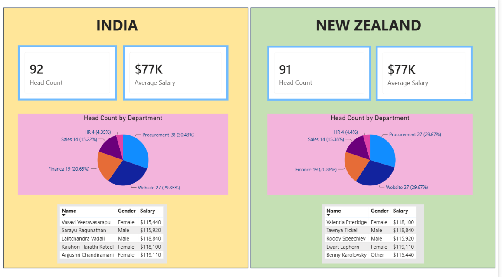

# 🌍 Global Employee Analytics Dashboard

An interactive **Power BI** dashboard that analyzes and compares workforce data across two countries — **India** and **New Zealand** — covering headcount, salary, department distribution, performance ratings, age demographics, and hiring trends.



---

## 📌 Project Overview

This project explores HR data for a multinational company to answer key workforce questions such as headcount per department, gender distribution, salary ranges, top earners, performance spread, and growth trends — culminating in a side-by-side **India vs. New Zealand scorecard**.

The dashboard was built end-to-end in Power BI: data cleaning in Power Query, a small relational data model, DAX measures, and an interactive report with slicers for self-service filtering.

---

## 📂 Repository Structure

```
Global-Employee-Analytics-Dashboard/
│
├── README.md                                  # Project overview (this file)
├── Documentation.md                            # Detailed project documentation
├── global-employee-analytics-dashboard.pbix     # Power BI dashboard file
├── hr-data.xlsx                                 # Raw/source HR dataset
├── Global-Employee-analytis-dashboard.png       # Final dashboard screenshot (India vs NZ view)
├── Physical_Model.png                           # Data model / table relationships screenshot
├── table___measures.png                         # Fields, columns & measures screenshot
└── Questions.png                                # Business questions & KPI brief used to scope the project
```

---

## 🗃️ Dataset

**File:** `hr-data.xlsx`
**Rows:** 183 employee records
**Columns:**

| Column | Description |
|---|---|
| Name | Employee full name |
| Gender | Male / Female / Other |
| Age | Employee age (19–46) |
| Rating | Performance rating (Poor, Very Poor, Average, Above Average, Exceptional) |
| Date Joined | Date the employee joined the company |
| Department | HR, Sales, Procurement, Finance, Website |
| Salary | Annual salary (USD) |
| Country | IND (India) or NZ (New Zealand) |

---

## 🧮 Data Model

The model (see `Physical_Model.png`) uses two tables:

- **Data** — the main fact/dimension table holding all 183 employee records, plus calculated columns:
  - `Age (bins)` — grouped age ranges, used for the age-spread histogram
  - `First Letter` — first letter of employee name, used for the alphabet filter
- **field order** — a small lookup table (`Order`, `Rating`) related **1-to-many** to `Data[Rating]`, used purely to apply a logical custom sort (Poor → Very Poor → Average → Above Average → Exceptional) instead of Power BI's default alphabetical sort.

Full field/measure list is captured in `table___measures.png`.

---

## 📊 KPIs (Cards)

| KPI | Description |
|---|---|
| **Head Count** | Count of employees, shown per country |
| **Average Salary** | Average salary, shown per country |
| **Max Salary** | Highest salary in a department/filter context |
| **Min Salary** | Lowest salary in a department/filter context |

Country scorecard example: **India** — 92 Head Count, $77K Average Salary · **New Zealand** — 91 Head Count, $77K Average Salary.

---

## 🎛️ Slicers

The report uses the following slicers to let users filter every visual interactively:

- **Country** (IND / NZ)
- **Department** (HR, Sales, Procurement, Finance, Website)
- **Gender** (Male, Female, Other)
- **Date Joined** (date range / year)
- **First Letter** (A–Z employee name filter)

### How the slicers were added (step by step)

1. Select the field you want to filter by (e.g., `Data[Country]`) in the **Fields** pane.
2. Go to **Insert → Slicer** (or drag the field onto a blank canvas area — Power BI auto-creates a slicer visual).
3. With the slicer selected, open the **Format** pane (paint-roller icon) and set:
   - **Slicer settings → Style** to `Tile` or `Dropdown` depending on the field (Country/Gender = Tile, Date Joined = Between/Slider, First Letter = Dropdown).
4. Resize and align the slicer along the top or left of the report page.
5. Repeat for each field (Country, Department, Gender, Date Joined, First Letter).
6. To make slicers filter **both** report pages at once, select each slicer → **Format → General → Effects/Sync visuals** (or the **Sync slicers** pane: **View → Sync Slicers**), then tick the checkbox for every page the slicer should apply to.
7. Test interactivity by clicking a slicer value and confirming the KPI cards, charts, and table update accordingly.

---

## 📈 Visuals Used

- KPI Cards — Head Count, Average Salary (per country)
- Pie Chart — Head Count by Department
- Table — Name, Gender, Salary (Top Earners, sorted descending by salary)
- Histogram — Age spread (using `Age (bins)`)
- Bar/Column Chart — Min / Max / Average salary by department
- Bar Chart — Performance rating spread (custom sorted via `field order` table)
- Line Chart — Company growth trend (hires over time, by `Date Joined`)
- Scatter Chart — Performance rating vs. Salary
- Side-by-side scorecard — India vs. New Zealand comparison view

---

## 🎯 Business Questions Answered

See `Questions.png` for the original brief. In summary, the dashboard answers:

1. How many people are there in each department?
2. What is the gender distribution by department?
3. What is the age spread of our staff?
4. What are the min / max / average salaries in each department?
5. Who are the top earners in each country?
6. What does the performance rating spread look like?
7. What is the company's growth trend (hiring over time)?
8. Can employees be filtered by the starting letter of their name?
9. Is there a relationship between performance and salary?
10. How do India and New Zealand compare at a glance?

---

## 🛠️ Tech Stack

- **Power BI Desktop** — data modeling, DAX, and report design
- **Power Query (M)** — data cleaning and transformation
- **DAX** — measures (Head Count, Average/Min/Max Salary)
- **Excel** — source dataset

---

## 🚀 How to Use

1. Clone or download this repository.
2. Open `global-employee-analytics-dashboard.pbix` in **Power BI Desktop** (free download from Microsoft).
3. If prompted, update the data source path to point to your local copy of `hr-data.xlsx`.
4. Click **Refresh** on the Home ribbon to load the data.
5. Interact with the slicers to explore the report.

---

## 📤 How This Repository Was Created & Published (Git/GitHub steps)

1. **Create the repository on GitHub**
   - Go to [github.com](https://github.com) → click **New repository**.
   - Name it `Global-Employee-Analytics-Dashboard`, add a short description, choose **Public**, and check **Add a README file**.
   - Click **Create repository**.

2. **Clone it locally**
   ```bash
   git clone https://github.com/<your-username>/Global-Employee-Analytics-Dashboard.git
   cd Global-Employee-Analytics-Dashboard
   ```

3. **Add the project files**
   - Copy `global-employee-analytics-dashboard.pbix`, `hr-data.xlsx`, all screenshot `.png` files, `README.md`, and `Documentation.md` into the folder.

4. **Stage, commit, and push**
   ```bash
   git add .
   git commit -m "Add Global Employee Analytics Dashboard: pbix, dataset, docs, and screenshots"
   git push origin main
   ```

5. **Verify on GitHub**
   - Refresh the repository page and confirm all files appear, and that the README renders with the embedded dashboard image.

6. **(Optional) Tag a release**
   ```bash
   git tag -a v1.0 -m "Initial release of Global Employee Analytics Dashboard"
   git push origin v1.0
   ```

---

## 📄 Documentation

For a deeper walkthrough of the project goal, data cleaning steps, DAX measures, and insights, see **[Documentation.md](https://github.com/DRasool7013/-Global-Employee-Analytics-Dashboard/blob/main/Documentation.md)**.

---

## 👤 Author

Portfolio project — Power BI / Data Analytics.
